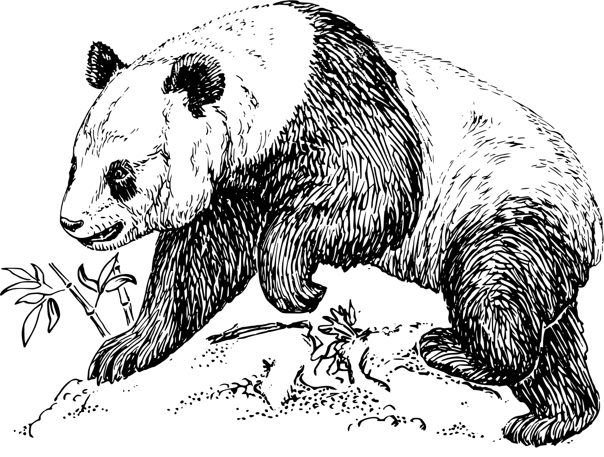
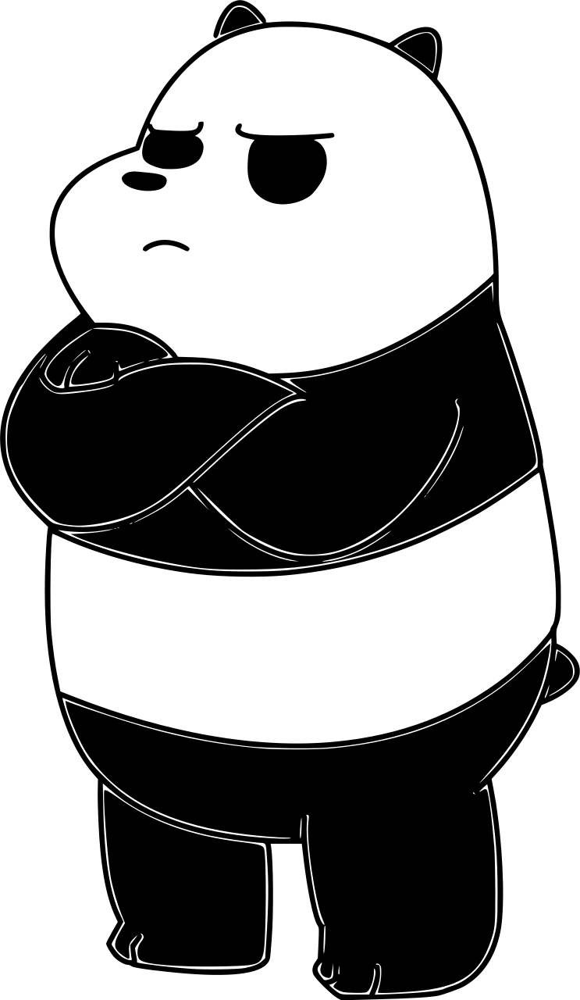

  <table>
    <tr>
      <td></td>
      <td></td>
      <td></td>
    </tr>
  </table>
  
  <!--   my-icons -->
  

      
      
      
      
      
         
  

  <!--   header image -->
  

    
    
  

  

<!--
**Tianyuyuyuyuyuyu/Tianyuyuyuyuyuyu** is a ✨ _special_ ✨ repository because its `README.md` (this file) appears on your GitHub profile.

Here are some ideas to get you started:

- 🔭 I'm currently working on ...
- 🌱 I'm currently learning ...
- 👯 I'm looking to collaborate on ...
- 🤔 I'm looking for help with ...
- 💬 Ask me about ...
- 📫 How to reach me: ...
- 😄 Pronouns: ...
- ⚡ Fun fact: ...
-->